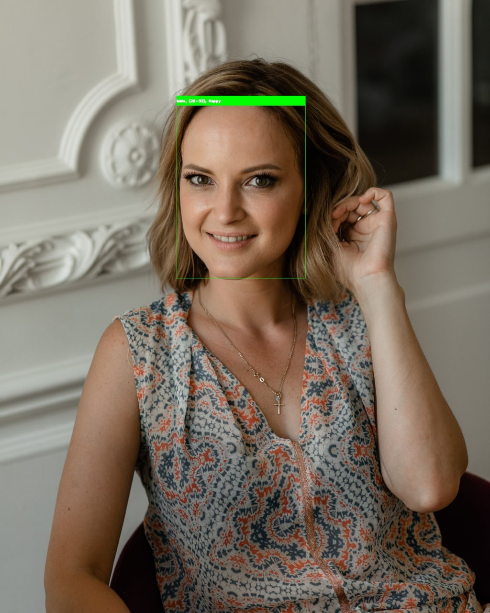
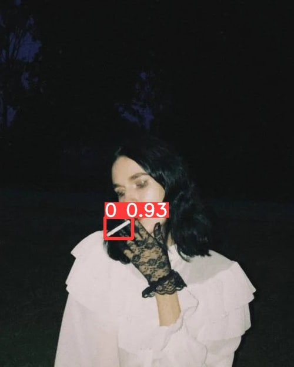
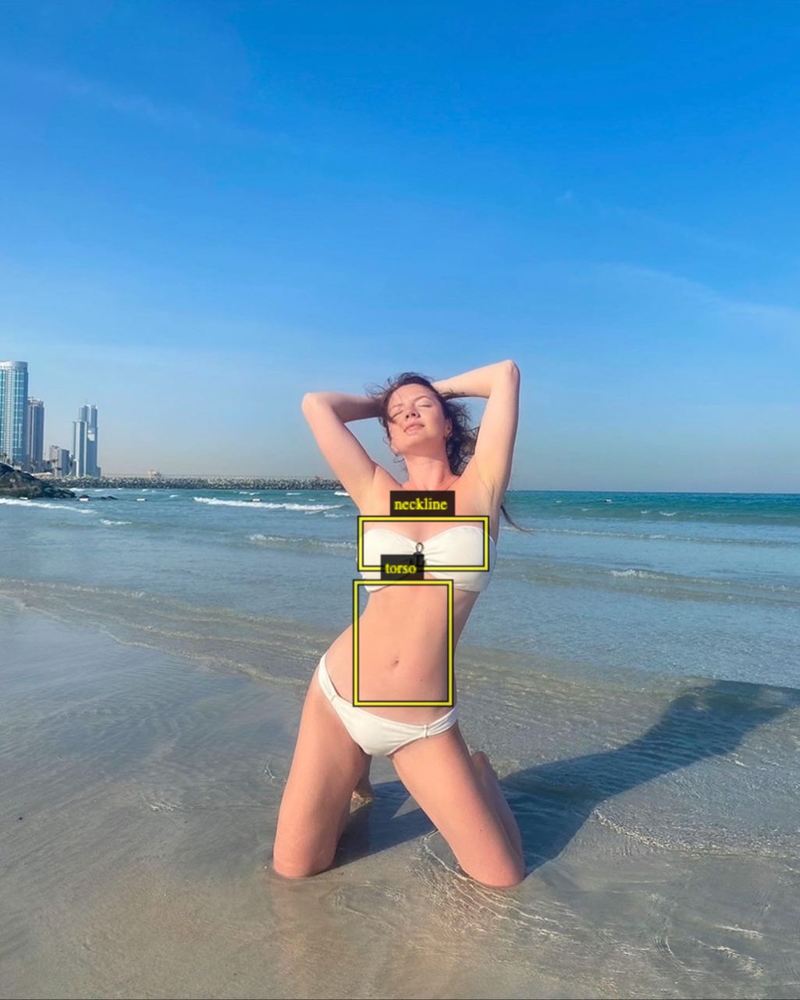

# TinAnal

Dependences of some parameters (like smoking, hobbies) on age were identified based on the questionnaires of 500 women and more than 500 men in the popular Tinder application.

The analysis of the photographs of the respondents was carried out using a neural network. Some classes (hips, necline, torso) were labeled manually.
 <h3>Dataset:  https://drive.google.com/drive/folders/1EfDrZLFfxWnbUQaTykqQRI-VdrVAAUQM?usp=sharing </h3>

<h3> List of parameters:</h3>
<li>Cigarette on the picture</li>
<li>Flowers on the picture</li>
<li>Pets on the picture</li>
<li>Cell phone on the picture</li>
<li>lcohol on the picture</li>
<li>Car on the picture</li>
<li>Smile on the picture</li>
<li>Torso, hips and necline on the picture</li>
<li>Popular hobbies</li>

<h2> About data</h2>
<li>women.json men.json - original data</li>
<li>women_result.csv men_result.csv - Tinder analysis</li>

<h3>Detecting examples (smile, cigarette, torso, flower)</h3>

